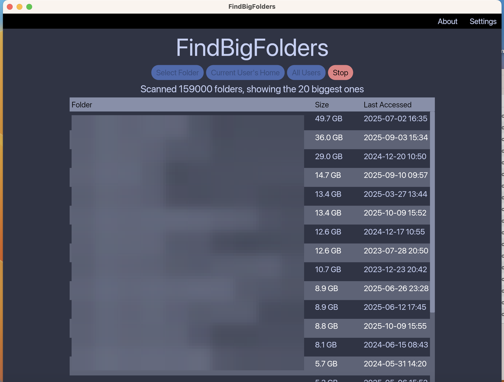

# FindBigFolders




Free up space on your hard disk

## Features

* Fast
* Light-weight
* Simple UI

## Works on


## How to Install

Use the pre-built executables from the [releases](https://github.com/debamitro/du-gui-rs/releases) page.
Here are the direct links to the latest release:

- [Windows](https://github.com/debamitro/du-gui-rs/releases/download/0.3.0/findbigfolders_0.3-x86_64-windows.zip)
- [MacOS (Apple Silicon)](https://github.com/debamitro/du-gui-rs/releases/download/0.3.0/findbigfolders_0.3.dmg)
- [MacOS (Intel)](https://github.com/debamitro/du-gui-rs/releases/download/0.3.0/findbigfolders_0.3-x86_64-apple-darwin.dmg)
- [Linux (x86_64)](https://github.com/debamitro/du-gui-rs/releases/download/0.3.0/findbigfolders_0.3-x86_64-linux.zip)

## How to Build

```bash
cargo build # build only
cargo run # build and run
```

